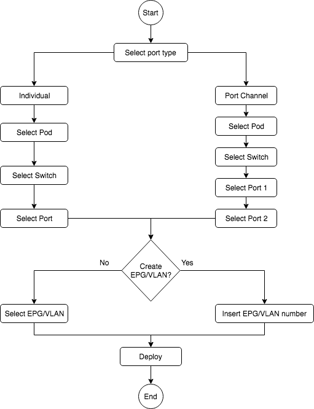
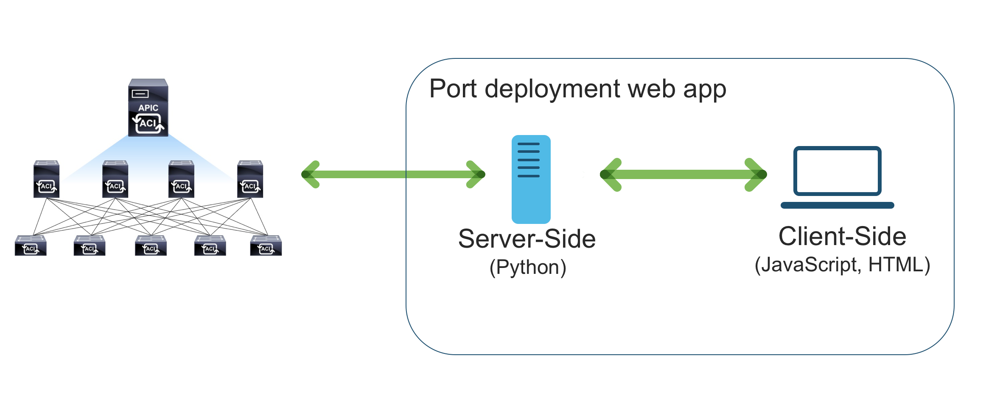

# Cisco Live US - Devnet workshop 2897
This file will provide you with instructions around how to write JavaScript, HTML and python code to create a 
port automation web user interface on top of Cisco ACI

If you have any questions feel free to send them to sfloresk@cisco.com

## Use case

A company is implementing ACI in its data center. They think the user interface that comes with the solution is great, 
however, they would like to implement the following process:

In order to get this done in ACI we will need to create:
 * Switch profiles
 * Interface policies
 * Interface policy groups
 * Tenants
 * Application profiles
 * End point groups
 * Bridge domains
 * VRFs
 * VLAN pools
 * Attachable entity profiles
 * Physical domains

How we can create all these objects if we must align with the process defined above?

## Solution

In order to support this workflow, a simplified web user interface that abstract all the objects that 
we saw before can be made with the comprehensive set of APIs that ACI provides. 

In this solution, an operator can simply select the port type, switch-port and VLAN, and the solution will create all 
the needed configuration in ACI.

For your reference, we are going to use the following frameworks

* django Web Framework - https://www.djangoproject.com/
* Angular JS Framework - https://angularjs.org/ 
* Cisco UI Framework - https://developer.cisco.com/site/uiux/ 

This is the overall architecture of the solution:

Any web app has a client-server architecture. In this lab we will the client-side 
(using HTML and a JavaScript library called Angular JS)

At the end of the lab, you will have a fully functional web app that can interact with Cisco ACI.

[Get Started!]
 
[Get Started!]: lab/step1.md
