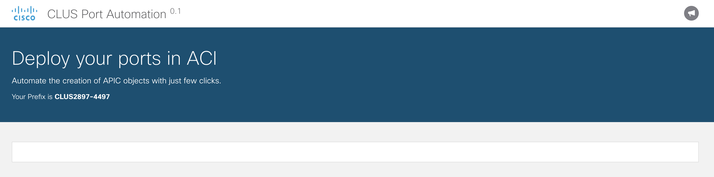

### Step 2 - Running the server

To run the server, execute these commands in your terminal:

```bash
cd $HOME/CLUS18-DEVNET-2897
python manage.py runserver 0.0.0.0:8080
```

This executes the manage.py file and pass as a parameter the action (runserver) along with the 
IPs that are allowed to connect (0.0.0.0 means anyone) with the port where the server will be listening for 
http requests (8080)

You can now open Chrome and go to http://0.0.0.0:8080/ to see the base layout. 



You have a web application up and running in your machine.

Next -> [Step 3 - Adding the port type UI]

[Step 3 - Adding the port type UI]: step3.md

