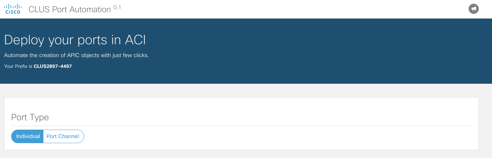

### Step 3 - Adding the port type 

The first thing that we want to do is to define which type of port we will create. According to the flow diagram, 
we could create an individual port or a port channel.

Copy the following code in the __**templates/web_app/home.html**__ file. You must include it within the 
```<div id="content-div" class="row">``` tag.

```html
<div id="port-type-div" class="col-md-12 text-large">
    <br/>
    <h4>Port Type
    </h4>
    <hr/>
    <!-- ****** Buttons to select port type ****** -->
    <div class="btn-group">
        <button class="btn btn--primary-ghost sn-type port-type selected"
                onclick="$('.port-type').removeClass('selected');$(this).addClass('selected')"
                ng-click="setPortType('access')">
            Individual
        </button>
        <button class="btn btn--primary-ghost sn-type port-type"
                onclick="$('.port-type').removeClass('selected');$(this).addClass('selected')"
                ng-click="setPortType('portChannel')">
            Port Channel
        </button>
    </div>
</div>

```

The code above creates a section with a header and two buttons that will be used to choose the port type to deploy;
either Individual or Port Channel

_Note: After you paste the code, use <kbd>option ⌥</kbd> + <kbd>command ⌘</kbd> + <kbd>L</kbd> to format the HTML file_

Refresh your browser to see the new components shown in the screen.



Next -> [Step 4 - Adding the port selection]

[Step 4 - Adding the port selection]: step4.md