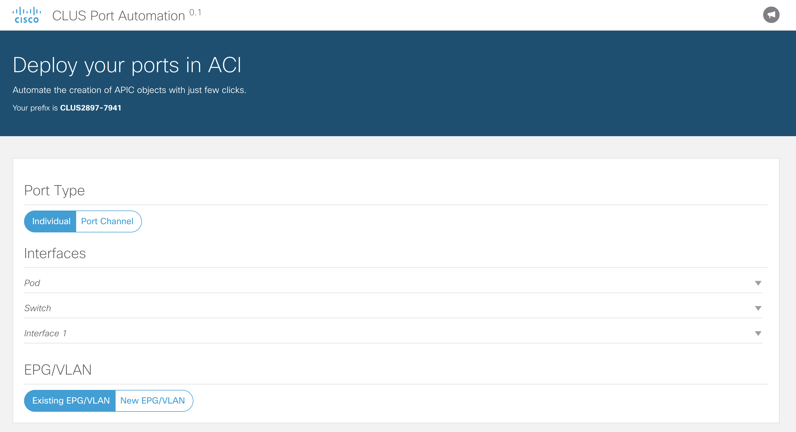

### Step 5 - Adding the EPG/VLAN options

Let's now add to the interface the options to select or create a new EPG/VLAN that the ports will be associated with.
The following code defines two buttons where the user is going to be able to select if a new EPG needs to be created
or if an existing one should be used.
Copy this code **below** the one added in step 4.

```html
<div id="epg-action" class="col-md-12 text-large">
    <br/>
    <h4>EPG/VLAN</h4>
    <hr/>
    <!-- ****** Buttons to select creation or selection of EPG/VLANs ****** -->
    <div class="btn-group">
        <button class="btn btn--primary-ghost sn-type epg-action selected"
                onclick="$('.epg-action').removeClass('selected');$(this).addClass('selected')"
                ng-click="setEpgAction('existing')">
            Existing EPG/VLAN
        </button>
        <button class="btn btn--primary-ghost sn-type epg-action"
                onclick="$('.epg-action').removeClass('selected');$(this).addClass('selected')"
                ng-click="setEpgAction('new')">
            New EPG/VLAN
        </button>
    </div>
</div>
```

_Note: Use <kbd>option ⌥</kbd> + <kbd>command ⌘</kbd> + <kbd>L</kbd> to format the HTML file in PyCharm_

Refresh your browser to see the new section in the screen.



Next -> [Step 6 - Adding the EPG/VLAN selection and creation fields]

[Step 6 - Adding the EPG/VLAN selection and creation fields]: step6.md
